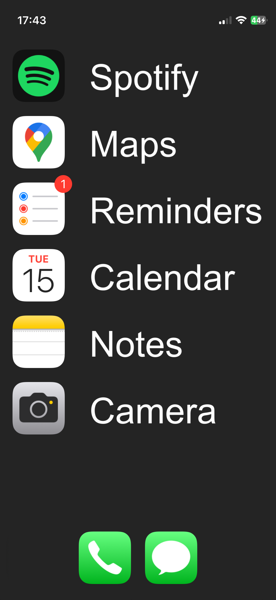
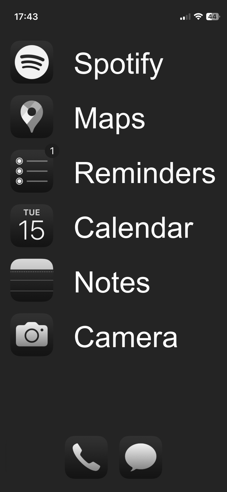
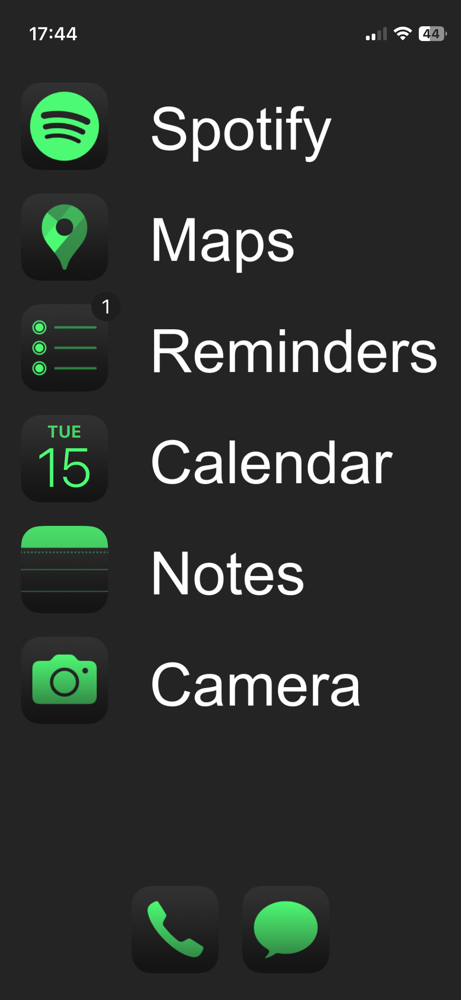
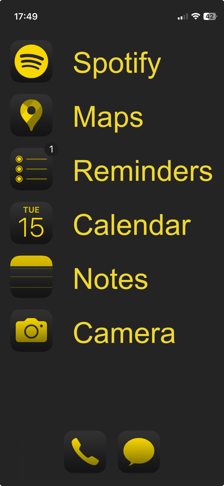

# Dumb iPhone Wallpaper Generator

This macOS script generates a customizable iPhone wallpaper with text rows. It's designed to help users create minimalist home screens.

## About
I want to use my smartphone as a practical tool without unnecessary distractions. Inspired by the [Light Phone](https://www.thelightphone.com/) concept, but without paid apps or shortcuts, I prefer a simple setup with just the default app icons. Thanks to iOS 18, I can arrange my icons in a 1-per-row style, allowing me to achieve this look.



## Usage

To run the script directly from GitHub, execute the following command in your terminal:
```bash
bash -c "$(curl -fsSL https://raw.githubusercontent.com/marosige/dumb-iphone-wallpaper/main/dumb-iphone-wallpaper.sh)" -- \
    -l1 "Line 1" -l2 "Line 2" -l3 "Line 3" -l4 "Line 4" -l5 "Line 5" -l6 "Line 6"
```

Modify the arguments from the 2nd line to get your background

## Required iPhone Settings

**Note: OS 18 is required for this wallpaper setup!**

### App Icon Settings

1. Long press on the home screen to enter "jiggle mode."
2. Tap `Edit` in the top left corner.
3. Select `Customize` from the menu.
4. Change the icon size toggle from `Small` to `Large` to hide the app name labels.
5. Optionally, set an icon tint color.
6. Ensure the top left corner shows a full sun icon (not shaded) to enable light mode. Tap the icon to toggle between light and dark modes.

### Layout Setup

1. Long press on the home screen to enter "jiggle mode."
2. Arrange the icons so that there's only **one icon per row**, aligned in the first column.
3. Use the same order for the script's line arguments (e.g., `-l1 "App 1" -l2 "App 2"`).

### Enabling Dark Mode

- To hide the dock, the wallpaper color should be set to `#242424` (the default) and dark mode should be enabled.
1. Go to `Settings`.
2. Tap `Display & Brightness`.
3. Under the `APPEARANCE` section, select `Dark` mode.

### Setting the Wallpaper

1. After running the script, the wallpaper will be saved in your Downloads folder.
2. AirDrop the image to your iPhone.
3. Open `Settings` on your iPhone.
4. Tap `Wallpaper`, then press the `Customize` button under your current home screen wallpaper.
5. Select `Photo` from the customization options at the bottom.
6. Tap the bottom-left icon to open your gallery.
7. Go to the `All` tab to view your photos.
8. Select the generated dumb wallpaper.

## Other Outputs

### White text
**Arguments:**
```bash
-l1 "Spotify" -l2 "Maps" -l3 "Reminders" -l4 "Calendar" -l5 "Notes" -l6 "Camera"
```




### Yellow Text
**Arguments:**
```bash
-l1 "Spotify" -l2 "Maps" -l3 "Reminders" -l4 "Calendar" -l5 "Notes" -l6 "Camera" -tc "#EDD850"
```



## Features

- **Background color**: Customize using `-bg` or `--background-color`
- **Text color**: Customize using `-tc` or `--text-color`
- **Labels**: Set text for each row with `-l1` to `-l6` or `--line1` to `--line6`
- If you skip a line (e.g., don’t provide `-l3`), that row will be left blank, allowing you to create all sorts of setups.

## Future Plans

- Expand support to all iPhone models.
- Improve customization options and features.

## System Requirements

- **Operating System**: macOS
- **Dependencies**: The script requires [ImageMagick](https://imagemagick.org) to generate the wallpaper.

### Installing ImageMagick on macOS

To install ImageMagick, you need to have [Homebrew](https://brew.sh/) installed. If you don’t have Homebrew yet, follow these steps:

1. Open the Terminal app.
2. Install Homebrew by running the following command:
    ```bash
    /bin/bash -c "$(curl -fsSL https://raw.githubusercontent.com/Homebrew/install/HEAD/install.sh)"
    ```
3. Once Homebrew is installed, use it to install ImageMagick by running:
    ```bash
    brew install imagemagick
    ```
4. Verify that ImageMagick is installed correctly by running:
    ```bash
    magick -version
    ```

After ImageMagick is installed, you’re ready to run the script.

---

Enjoy your dumb iPhone wallpaper! 🚀
